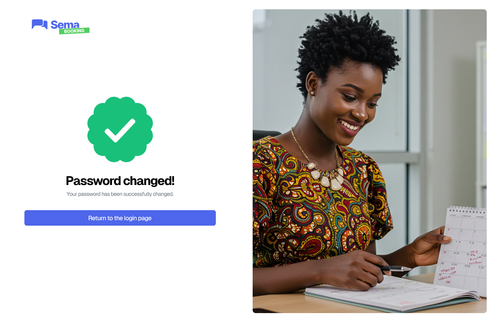

Authentication
=================

**User Login**

The goal here is to allow any authorized user (receptionist, practitioner, administrator) to access the platform.

.. image:: ../images/image0EN.png

- If the user forgets their password, a code will be sent to the email address they provide, allowing them to regain access to their account:

- Once the code is verified, a **new password** will be created to complete the reset:

