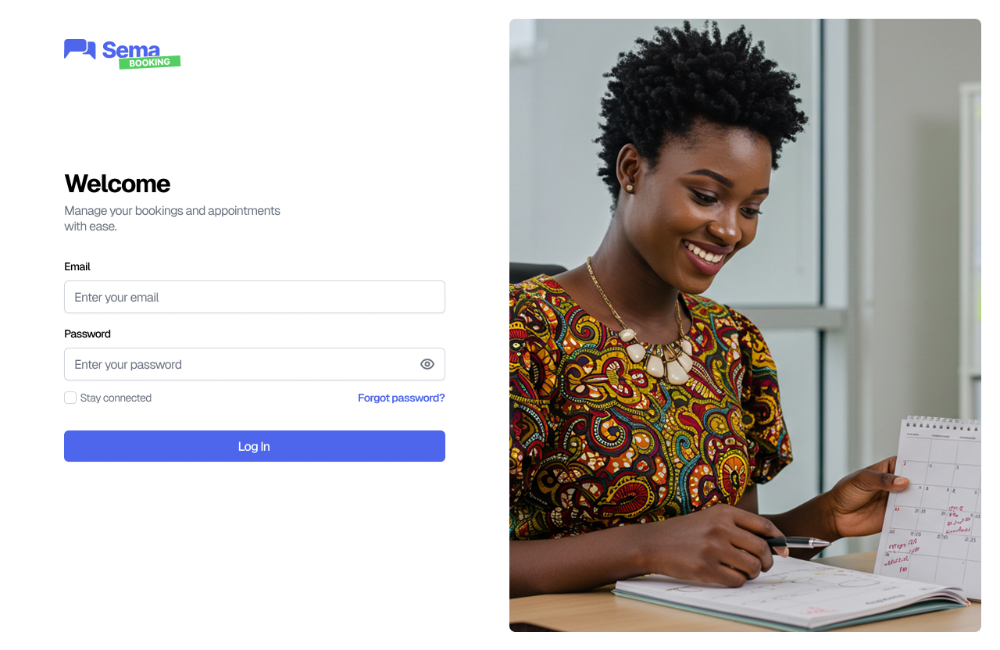

.. Boonking SEMA documentation master file, created by
   sphinx-quickstart on Mon Oct 20 14:10:41 2025.
   You can adapt this file completely to your liking, but it should at least
   contain the root `toctree` directive.

Welcome to Booking SEMA's documentation!
=========================================

Appointment Booking

Booking refers to all the actions required to book a service with a practitioner via the platform.
It involves a series of steps from collecting client information to confirming the appointment, including selecting the service, host, and time slot.
This process can be initiated by a user via the chatbot or by a receptionist from the management interface.

.. toctree::
   :maxdepth: 2
   :caption: Authentication

   Authenticate/index.rst

.. toctree::
   :maxdepth: 2
   :caption: Dashboard

   Dashboard/index.rst

.. toctree::
   :maxdepth: 2
   :caption: Organization

   Organisation/index.rst

.. toctree::
   :maxdepth: 2
   :caption: Tasks and Services

   Task/index.rst  

.. toctree::
   :maxdepth: 2
   :caption: Settings

   Parameters/index.rst  
 
