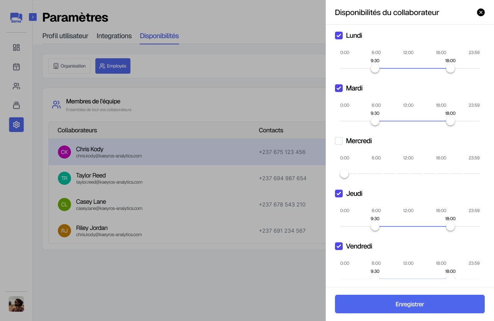

Paramètres
===========

**1. Informations du profil**

L'objectif ici est de permettre à l’utilisateur de gérer ses informations personnelles.

Il est possible de : 

* Modifier les **informations générales** (nom, email, photo, etc.) 

**2. Intégrations et disponibilités**

Ici, il est question de configurer les préférences de calendrier et les plages horaires. 
La synchronisation de calendrier peut se faire avec **Google Calendar**, **Apple Calendar** ou encore **Outlook**.

La configuration des disponibilités est possible pour l’organisation :

Ainsi que pour les employés :

