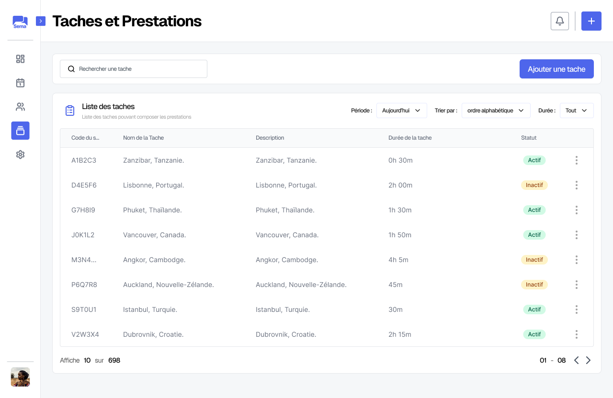
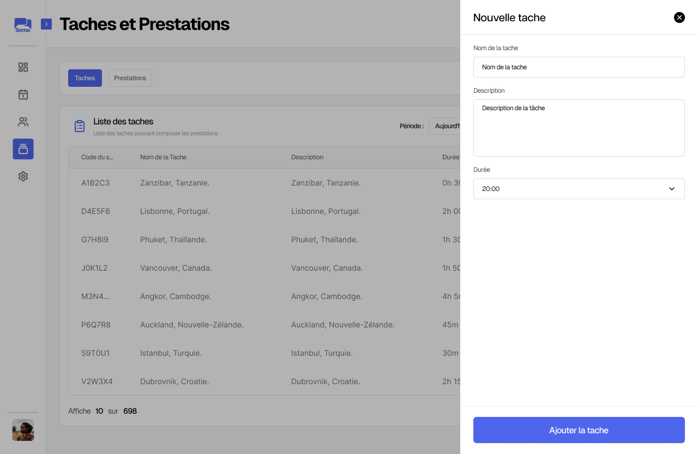
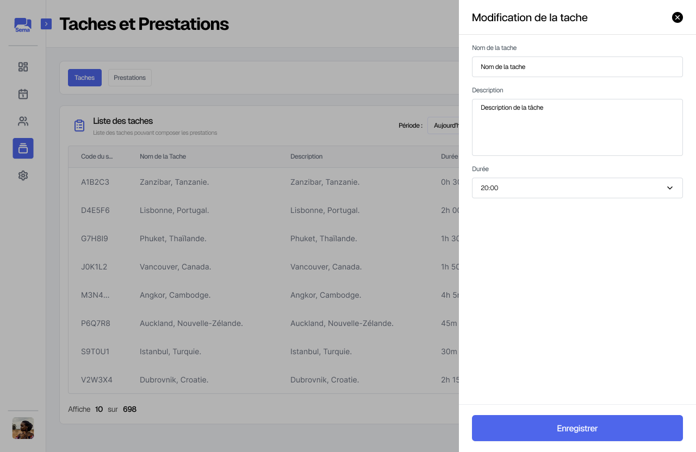
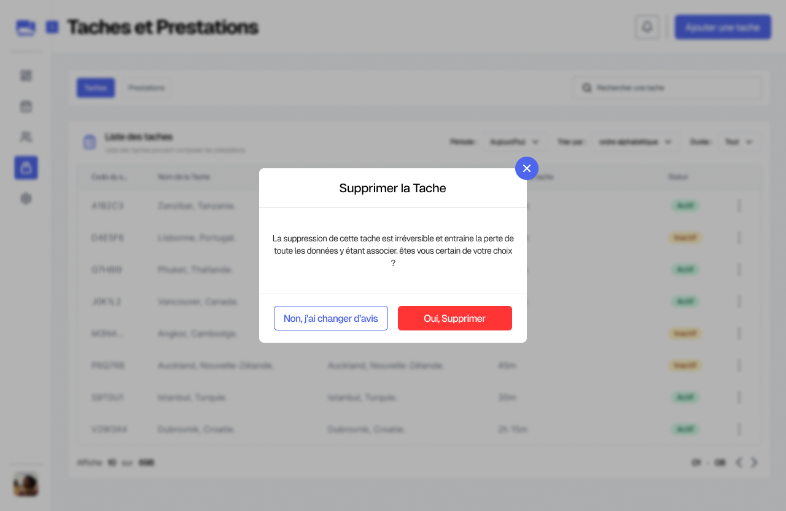
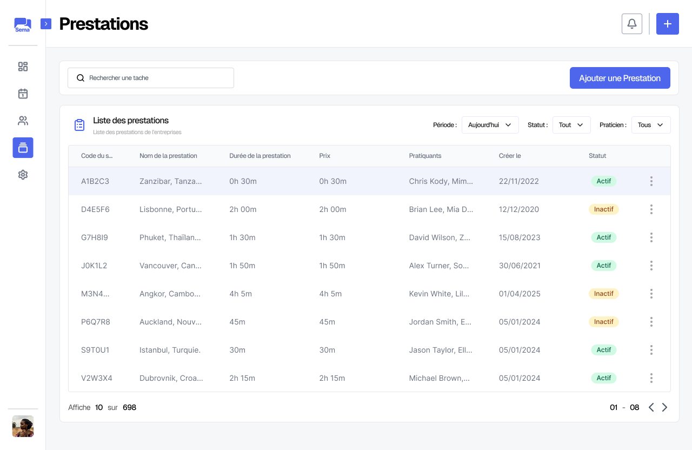
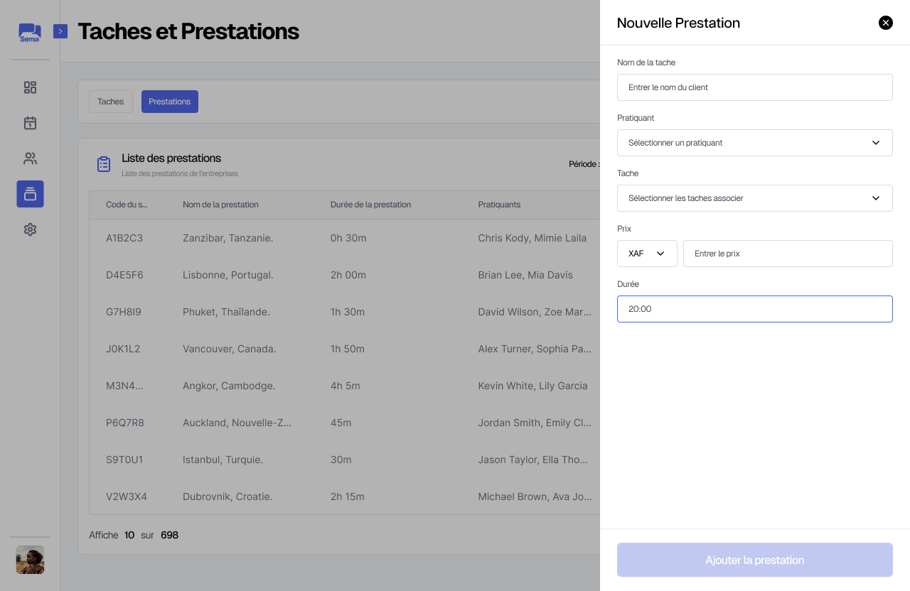
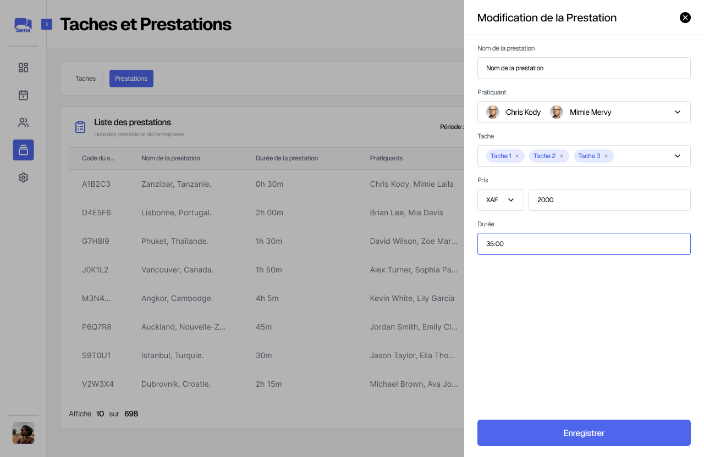
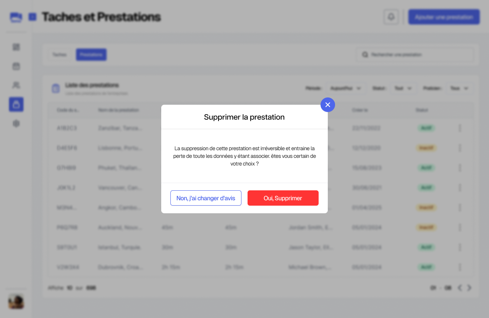

Taches et Prestations
=======================

Gestion des Taches
===================

Il s'agit de gérer les tâches qui composent les prestations offertes :

* On peut **créer** une nouvelle tâche :

* **Modifier** une tâche existante :

* **Supprimer** une tâche

Gestion des Prestations
========================

Il est question ici d'administrer les prestations proposées par l’organisation :

* On peut **créer** une nouvelle prestation :

* **Modifier** une prestation existante : 

* **Supprimer** une prestation :

