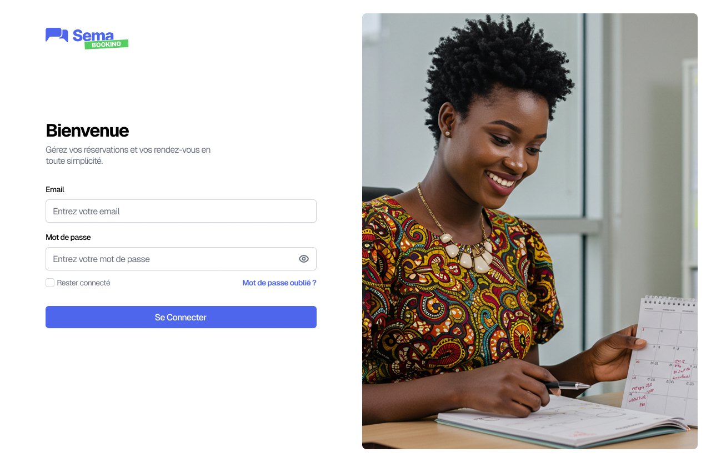

.. Booking SEMA documentation master file, created by
   sphinx-quickstart on Mon Oct 20 14:09:51 2025.
   You can adapt this file completely to your liking, but it should at least
   contain the root `toctree` directive.

Bienvenue dans la documentation de Booking SEMA !
==================================================

**Prise de rendez-vous**

Le **booking**, ou **prise de rendez-vous**, désigne l’ensemble des actions permettant de **réserver une prestation** auprès d’un praticien via la plateforme.
Il s’agit d’un enchaînement d’étapes allant de la **collecte des informations du client** à la **validation du rendez-vous**, en passant par la **sélection de la prestation**, de l’hôte et du créneau horaire.
Ce processus peut être initié par un **utilisateur via le chatbot** ou par une **réceptionniste depuis l’interface de gestion**.

.. toctree::
   :maxdepth: 2
   :caption: Authentification

   Authenticate/index.rst

.. toctree::
   :maxdepth: 2
   :caption: Tableau de bord et Agenda

   Dashboard/index.rst

.. toctree::
   :maxdepth: 2
   :caption: Organisation

   Organisation/index.rst

.. toctree::
   :maxdepth: 2
   :caption: Taches et prestations

   Task/index.rst  

.. toctree::
   :maxdepth: 2
   :caption: Parametres

   Parameters/index.rst  
 
